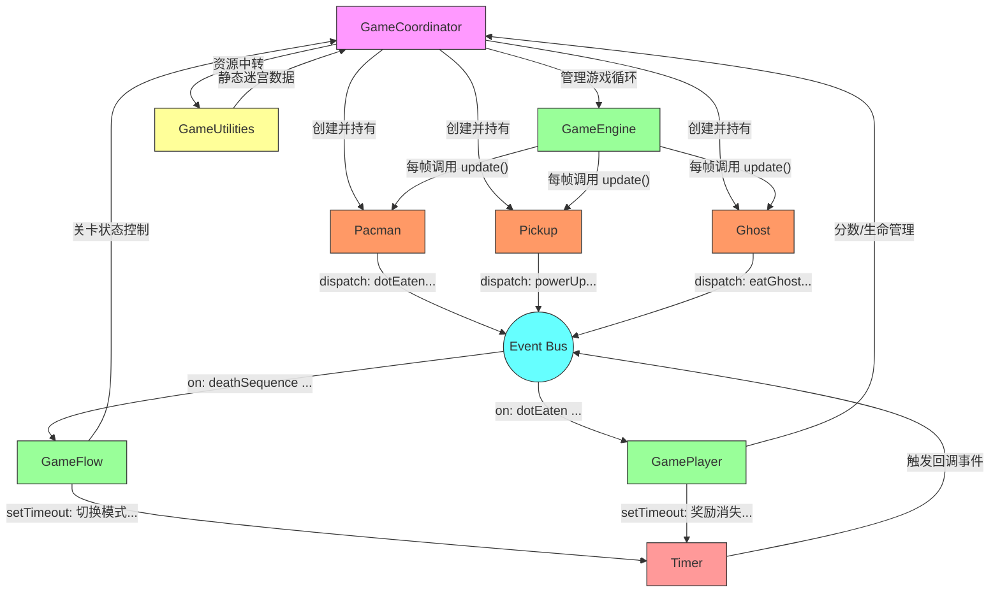
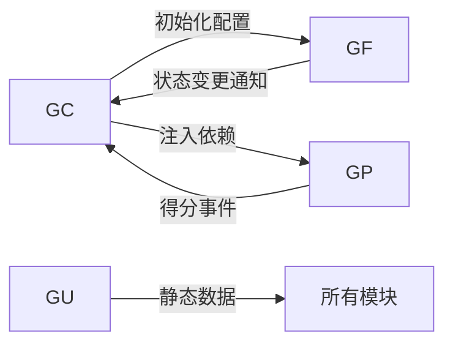
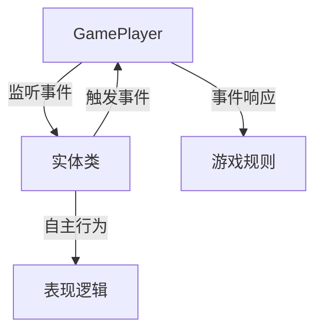

# 整体架构图


# 类职责分析

---
### 核心容器 (Container)
#### GameCoordinator
**职责**：游戏总控中心，负责全局协调
- 初始化所有游戏元素（迷宫、角色、UI）
- 管理游戏生命周期（开始/暂停/结束）
- 协调子系统间通信（事件派发）
- 维护全局状态（分数/关卡/生命值）
- 处理用户输入（键盘/触摸）
- 管理资源加载流程

---
### 实体类 (Entities)
#### Pacman
**职责**：玩家角色控制
- 处理移动逻辑（方向转换/碰撞检测）
- 管理吃豆动画状态
- 死亡动画处理
- 箭头指示器控制

#### Ghost
**职责**：幽灵AI实体
- 实现四种幽灵行为模式（追击/散射/恐惧/回巢）
- 路径寻路算法（包含各幽灵特有策略）
- 状态切换管理（正常/恐惧/重生）
- 速度模式控制（普通/加速）

#### Pickup
**职责**：可收集物品管理
- 三种类型物品行为（豆子/大力丸/水果）
- 碰撞检测优化（距离检测+精确碰撞）
- 物品显示/隐藏控制
- 得分事件触发

---
### 逻辑控制层 (Logic)
#### GameEngine
**职责**：游戏循环引擎
- 主循环驱动（基于requestAnimationFrame）
- 帧率控制与时间步长管理
- 实体更新调用（update/draw）
- 性能监控（FPS计算）

#### GameFlow
**职责**：游戏流程控制
- 关卡推进逻辑
- 游戏状态转换（准备/进行/结束）
- 暂停系统实现
- 过场动画控制
- 全局计时器管理

#### GamePlayer
**职责**：玩家互动逻辑
- 得分计算与显示
- 连击系统实现
- 特殊状态处理（无敌/加速）
- 奖励物品生成
- 生命管理系统

---
### 支持系统 (Support Systems)
#### SoundManager
**职责**：音频管理系统
- 音效播放控制
- 环境音效循环
- 音量全局控制
- 音频资源预加载
- 场景音效适配

#### Timer
**职责**：时间控制系统
- 精确计时器实现
- 暂停/恢复功能
- 定时事件回调
- 跨场景计时管理

---
### 工具与数据 (Utilities)
#### GameUtilities
**职责**：静态资源管理
- 迷宫结构定义
- 资源预加载系统
- 通用图形常量
- 移动端手势适配

#### CharacterUtil
**职责**：角色运动支持
- 网格对齐计算
- 运动方向转换
- 越界处理（传送门）
- 动画帧更新
- 运动插值计算

---
### 事件系统 (Event System)
#### Event Bus
**职责**：事件驱动中枢
- 跨模块通信管道
- 事件类型定义
- 订阅/发布机制
- 异步事件处理

---
### 架构特点
1. **分层清晰**：容器层->实体层->逻辑层->支持层
2. **事件驱动**：通过Event Bus实现松耦合
3. **状态隔离**：游戏状态由GameCoordinator统一管理
4. **性能优化**：采用分帧检测和距离优化策略
5. **扩展性强**：幽灵AI和物品系统采用策略模式


# 边界设计理念
## GameCoordinator 和 GameFlow，GameUtilities，GamePlayer 之间的边界
---

### **GameCoordinator（游戏协调器）**
**核心职责边界**：
1. **系统入口** 
   - 游戏启动初始化
   - 主场景元素挂接（迷宫/角色/UI）

2. **跨系统路由**
   ```javascript
   // 典型调用模式
   class GameCoordinator {
     constructor() {
       this.gameFlow = new GameFlow(this);
       this.gamePlayer = new GamePlayer(this);
       this.gameUtilities = new GameUtilities();
     }
   }
   ```

3. **事件总线管理**
   - 注册全局事件监听器
   - 事件分发（非业务逻辑处理）

4. **持久化数据**
   - 最高分存储
   - 用户设置（音量等）

**禁止行为**：
- 直接修改游戏状态（如分数增减）
- 实现具体游戏规则逻辑

---

### **GameFlow（游戏流程控制器）**
**核心职责边界**：
1. **状态机管理**
   ```mermaid
   stateDiagram-v2
     [*] --> StartScreen
     StartScreen --> Gameplay: 按下开始
     Gameplay --> Pause: ESC按下
     Pause --> Gameplay: 恢复
     Gameplay --> LevelComplete: 吃完豆子
     LevelComplete --> Gameplay: 下一关
     Gameplay --> GameOver: 生命耗尽
   ```

2. **关卡生命周期**
   - 关卡开始/结束逻辑
   - 过场动画控制
   - 幽灵集体行为（群体模式切换）

3. **时间序列控制**
   ```javascript
   // 典型时间控制逻辑
   startLevelTransition() {
     new Timer(() => this.flashMaze(), 500);
     new Timer(() => this.resetPositions(), 2000);
   }
   ```

**禁止行为**：
- 直接操作非游戏状态切换关联的UI元素，
- 处理单个幽灵的具体AI

---

### **GamePlayer（玩家交互处理器）**
**核心职责边界**：
1. **玩家行为反馈**
   - 得分计算（连击/奖励机制）
   - 生命值变化
   - 特殊状态触发（无敌/加速）

2. **奖励系统**
   ```javascript
   handleFruitCollection(points) {
     this.points += points;
     this.updateFruitDisplay(this.fruitImages[points]);
   }
   ```

3. **成就系统**
   - 万分离奇判定
   - 额外生命授予

**禁止行为**：
- 直接修改游戏全局状态
- 控制非玩家相关实体

---

### **GameUtilities（游戏工具集）**
**核心职责边界**：
1. **静态数据服务**
   ```javascript
   static get mazeLayout() {
     return [
       ['XXXXXXXXXXXXXXXXXXXXXXXXXXXX'],
       ['XooooooooooooXXooooooooooooX'],
       // ...完整迷宫数据
     ];
   }
   ```

2. **算法工具包**
   - A*路径查找
   - 碰撞检测算法
   - 移动预测计算

3. **单位转换**
   - 屏幕坐标 ↔ 网格坐标
   - 动画帧率计算

**禁止行为**：
- 持有游戏状态
- 触发游戏事件

---

### **边界交互协议**
#### 1. 数据流向规则


#### 3. 异常处理边界
- **GameCoordinator**：处理系统级错误（资源加载失败）
- **GameFlow**：处理游戏逻辑错误（无效状态转换）
- **GamePlayer**：处理玩家输入异常（非法操作）

---

### **边界检查清单**
1. **是否跨层访问**？
   - 工具集不应直接调用流程控制器

2. **是否单一职责**？
   - 分数计算只在GamePlayer出现

3. **是否状态泄露**？
   - 游戏流程状态应由GameFlow独占

4. **是否事件闭环**？
   - 所有模块间通信必须通过事件总线


## GamePlayer 和 实体类 (Entities) 的边界怎么设定
---

### **边界划分原则**


---

### **1. 输入控制边界**
#### 实体类职责：
- 接收原始输入信号
- 处理物理移动约束
```javascript
// Pacman.js
handleKeyPress(keyCode) {
  this.desiredDirection = this.inputMap[keyCode] || this.direction;
  this.validateMovement(); // 检查墙面碰撞
}
```

#### GamePlayer职责：
- 解释输入语义
- 处理高阶行为
```javascript
// GamePlayer.js
onSwipe(direction) {
  if (this.powerupActive) {
    this.activateDash(direction); // 特殊技能逻辑
  }
}
```

---

### **2. 状态变更边界**
#### 实体类职责：
- 维护自身状态机
- 执行状态转换
```javascript
// Ghost.js
enterScaredMode() {
  this.mode = 'scared';
  this.speed = this.scaredSpeed;
  this.updateSprite();
}
```

#### GamePlayer职责：
- 触发状态变更条件
- 管理全局状态影响
```javascript
// GamePlayer.js
handlePowerPellet() {
  this.ghosts.forEach(ghost => {
    ghost.triggerStateChange('scared'); // 通过事件触发
  });
  this.startPowerupTimer();
}
```

---

### **3. 碰撞处理边界**
#### 实体类职责：
- 基础碰撞检测
- 物理响应
```javascript
// Pickup.js
checkCollision(pacmanBounds) {
  return this.bounds.intersects(pacmanBounds); // 纯几何计算
}
```

#### GamePlayer职责：
- 碰撞语义处理
- 游戏规则应用
```javascript
// GamePlayer.js
onCollision(type, entity) {
  switch(type) {
    case 'ghost':
      if (entity.mode === 'scared') {
        this.handleGhostEaten(entity); // 计算连击分
      }
      break;
    case 'fruit':
      this.awardPoints(entity.pointValue); 
      this.showFruitEffect(entity.type);
      break;
  }
}
```

---

### **4. 数据访问边界**
#### 实体类暴露接口：
```typescript
interface IEntity {
  position: Vector2;
  velocity: number;
  currentState: EntityState;
  getCollisionBounds(): BoundingBox;
}
```

#### GamePlayer禁止行为：
- 直接修改实体内部状态
- 访问非公开属性
```javascript
// 错误示例 ❌
gamePlayer.forceGhostPosition(ghost, x, y);

// 正确做法 ✅
ghost.navigateTo(targetPosition); // 实体自主寻路
```
### **边界检查清单**
1. **是否直接修改对方状态**？
   - ✅ 允许：实体自主调用 `entity.updatePosition()`
   - ❌ 禁止：GamePlayer 直接设置 `ghost.x = 100`

2. **是否包含业务逻辑判断**？
   - ✅ 允许：Pickup 判断 "是否被吃"
   - ❌ 禁止：Pickup 包含 "得分计算" 逻辑

3. **是否了解对方内部结构**？
   - ✅ 允许：GamePlayer 知道 `ghost.mode` 状态
   - ❌ 禁止：GamePlayer 访问 `ghost.pathfindingNodes`

4. **是否建立双向依赖**？
   - ✅ 允许：通过事件总线间接通信
   - ❌ 禁止：GamePlayer 持有实体实例的直接引用

---

### 小结：
通过这种边界划分，实体类保持纯粹的"模拟对象"特性，专注于自身状态管理和物理表现，而GamePlayer则成为"规则解释器"，专注于将底层交互转化为游戏语义。这种分离使AI重构、玩法修改等需求变更时，只需在对应层级调整，避免牵一发而动全身的情况。

