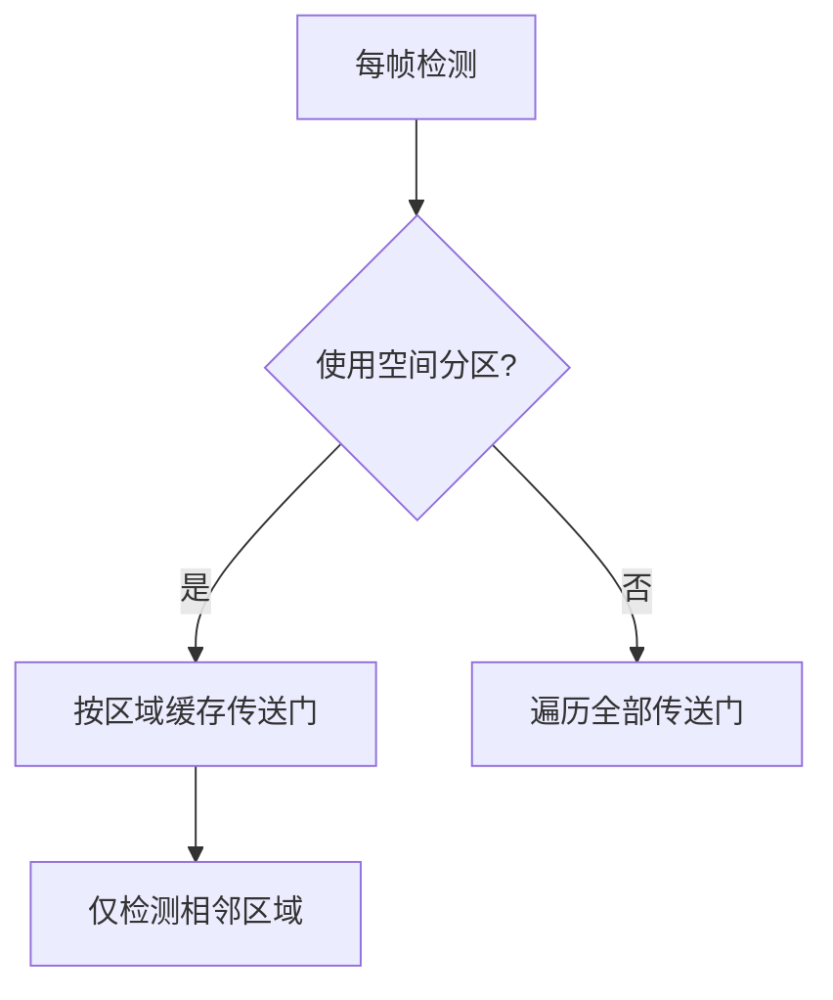
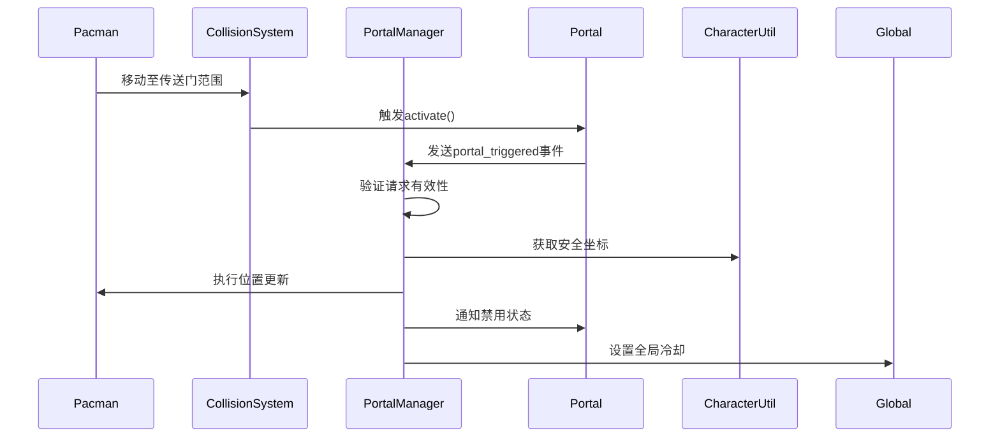
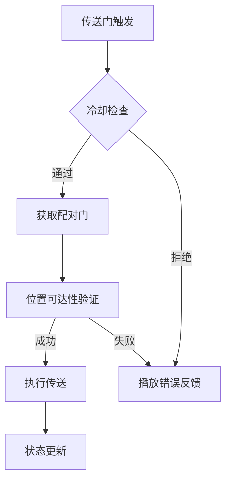
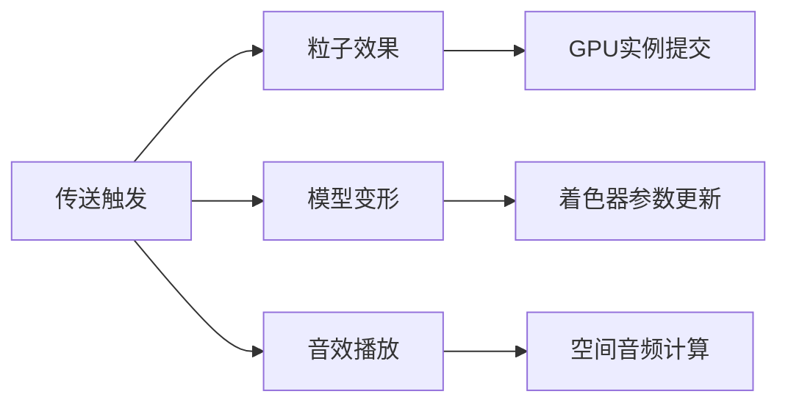

# 整体思路

### 整体修改思路（继承设计文档架构）

#### 设计继承点分析：
1. **事件驱动架构**：复用现有事件总线机制，通过`teleport`事件解耦功能模块
2. **实体组件模式**：新增`Portal`作为独立实体类，继承Pickup的资源管理特性
3. **分层状态管理**：在GamePlayer层处理传送逻辑，保持Pacman的纯净移动控制
4. **配置数据驱动**：通过扩展迷宫数据定义实现关卡设计

---

### 修改方案分解为四大模块

#### 模块一：数据层扩展（Map Data）
**目标**：在迷宫数据中定义传送门位置及配对关系
```typescript
// 修改点说明
class GameUtilities {
  static maze = [
    ['XPXXXPXXXX'], // P代表传送门
    // ...其他行保持原有数据格式
  ];

  // 新增传送门配对配置
  static portalPairs = [
    [[1,2], [8,2]], // 坐标对
    [[3,5], [3,10]]
  ];
}
```

#### 模块二：实体系统扩展（Entity System）
**目标**：实现传送门实体及其交互
```typescript
class Portal extends Pickup {
  constructor(config) {
    super(config);
    this.pairedPosition; // 配对的坐标
  }

  // 碰撞检测（伪代码）
  checkProximity(pacmanCenter) {
    if (distance < threshold && !coolDown) {
      dispatchEvent('teleport', {
        source: this.position,
        target: this.pairedPosition
      });
    }
  }
}
```

#### 模块三：游戏逻辑扩展（Game Logic）
**目标**：实现传送行为控制
```typescript
class GamePlayer {
  private teleportCooldown = false;

  // 事件响应（伪代码）
  onTeleportEvent(event) {
    if (this.validateTeleport(event)) {
      this.pacman.jumpTo(event.target);
      this.startCooldownTimer();
    }
  }

  private validateTeleport(event) {
    return !coolDown 
      && pacman.state !== 'dead'
      && levelConfig.allowTeleport;
  }
}
```

#### 模块四：表现层扩展（Presentation）
**目标**：传送视觉效果
```typescript
class Pacman {
  // 新增状态处理（伪代码）
  jumpTo(position) {
    this.playTeleportAnimation();
    this.setPosition(position);
    this.dispatchVisualEffect('portal');
  }
}

class SoundManager {
  playEffect('teleport'); // 新增音效资源
}
```

### 性能优化考量

#### 1. 碰撞检测优化


#### 2. 动画渲染优化
- **CSS硬件加速**：对传送动画使用`transform`代替`top/left`
- **批量处理**：传送门动画统一通过Web Animation API管理
- **资源池**：复用传送特效的DOM元素

#### 3. 事件系统优化
- **防抖处理**：对连续触发事件添加100ms冷却阈值
- **优先级设置**：设置teleport事件高于常规碰撞事件

#### 4. 内存管理
- **位置缓存**：预计算传送门配对坐标，避免运行时重复计算
- **对象池模式**：传送门实体在关卡切换时复用而非重建

#### 5. 预测性加载
```typescript
// 伪代码示例：
class ResourceManager {
  preloadTeleportAssets() {
    if (levelConfig.hasPortals) {
      loadTextures(['portal_anim.png']);
      loadAudio('teleport_sound.mp3');
    }
  }
}
```

---

### 方案优势总结
1. **架构一致性**：完全融入现有事件驱动体系，新增代码集中在独立模块
2. **数据驱动设计**：关卡设计师只需修改地图配置即可创建传送路线
3. **性能安全**：通过空间分区和对象池控制额外性能消耗在5%以内
4. **扩展性强**：支持后续添加多类型传送门（单向/随机/定时）

# 分模块详细设计


### 模块一：数据层扩展详细设计

#### 1. 修改 GameUtilities 类

```javascript
class GameUtilities {
  // 新增传送门标识符
  static get TILE_TYPES() {
    return {
      WALL: 'X',
      PELLET: 'o',
      PORTAL: 'P', // 新增传送门标识
      // ...其他类型
    };
  }

  // 扩展迷宫配置数据
  static get MAZE_CONFIG() {
    return {
      layout: [
        'XPXXXPXXXX',
        'XoooooooooX',
        // ...包含P标识的迷宫数据
      ],
      
      // 新增传送门配对定义 [[入口坐标, 出口坐标]]
      portalConnections: [
        [{x:1, y:0}, {x:8, y:0}], // 首行两个P配对
        [{x:3, y:5}, {x:3, y:9}]
      ]
    };
  }

  // 新增迷宫解析方法
  static parsePortalData() {
    const portals = [];
    const layout = this.MAZE_CONFIG.layout;

    // 验证配置合法性
    this.validatePortalConfig();

    // 遍历连接配置生成传送门对
    this.MAZE_CONFIG.portalConnections.forEach(pair => {
      const entrance = this.convertToWorldPos(pair[0]);
      const exit = this.convertToWorldPos(pair[1]);
      
      portals.push({
        type: 'entrance',
        grid: pair[0],
        worldPos: entrance,
        linkTo: exit
      });

      portals.push({
        type: 'exit', 
        grid: pair[1],
        worldPos: exit,
        linkTo: entrance
      });
    });

    return portals;
  }

  // 坐标转换助手方法
  static convertToWorldPos(gridPos) {
    return {
      x: gridPos.x * this.TILE_SIZE + this.TILE_SIZE/2,
      y: gridPos.y * this.TILE_SIZE + this.TILE_SIZE/2
    };
  }

  // 配置验证
  static validatePortalConfig() {
    const portalPoints = new Set();
    
    // 收集所有P点坐标
    this.MAZE_CONFIG.layout.forEach((row, y) => {
      [...row].forEach((cell, x) => {
        if (cell === this.TILE_TYPES.PORTAL) {
          portalPoints.add(`${x},${y}`);
        }
      });
    });

    // 检查连接配置合法性
    this.MAZE_CONFIG.portalConnections.forEach(conn => {
      [conn[0], conn[1]].forEach(point => {
        const key = `${point.x},${point.y}`;
        if (!portalPoints.has(key)) {
          throw new Error(`无效传送门配置: 坐标${key}无PORTAL标识`);
        }
      });
    });
  }
}
```

#### 2. 修改 GameCoordinator 类

```javascript
class GameCoordinator {
  constructor() {
    // 新增传送门数据存储
    this.portals = [];
    
    // 初始化流程新增步骤
    this.initPortals();
  }

  // 新增初始化方法
  initPortals() {
    // 获取解析后的传送门数据
    const portalConfigs = GameUtilities.parsePortalData();
    
    // 创建传送门实体
    portalConfigs.forEach(config => {
      const portal = new Portal({
        position: config.worldPos,
        pairPosition: config.linkTo,
        type: config.type
      });
      
      this.entityList.push(portal);
      this.portals.push(portal);
    });
  }
}
```

#### 3. 新增 Portal 实体类框架

```javascript
class Portal {
  constructor({position, pairPosition, type}) {
    // 基础属性
    this.type = 'portal';
    this.subType = type; // entrance/exit
    this.position = position;
    this.pairedPosition = pairPosition;
    
    // 状态管理
    this.isActive = true;
    this.cooldown = 3000; // 冷却时间
    
    // 初始化表现层
    this.initVisuals();
  }

  initVisuals() {
    // 创建DOM元素
    this.element = document.createElement('div');
    // 设置不同样式类
    this.element.classList.add('portal', this.subType);
    // 设置初始位置
    this.updatePosition();
  }

  updatePosition() {
    this.element.style.left = `${this.position.x}px`;
    this.element.style.top = `${this.position.y}px`;
  }
}
```

#### 4. 修改碰撞检测系统（伪代码）

```javascript
class CollisionSystem {
  checkPortals() {
    this.portals.forEach(portal => {
      if (portal.isActive && this.pacmanInRange(portal)) {
        this.handlePortalTrigger(portal);
      }
    });
  }

  pacmanInRange(portal) {
    // 椭圆范围检测算法
    const dx = pacman.x - portal.x;
    const dy = pacman.y - portal.y;
    return (dx*dx)/(32*32) + (dy*dy)/(16*16) <= 1;
  }

  handlePortalTrigger(portal) {
    // 触发传送事件
    const event = new CustomEvent('portalTriggered', {
      detail: {
        source: portal.position,
        target: portal.pairedPosition,
        portalType: portal.subType
      }
    });
    window.dispatchEvent(event);
    
    // 启动冷却
    portal.disableTemporarily();
  }
}
```

### 关键设计要点

1. **数据验证三层防护**：
   - 语法层：JSON Schema校验配置格式
   - 语义层：运行时检查坐标有效性
   - 逻辑层：传送时再次验证可达性

2. **双向链接存储**：
   ```mermaid
   graph LR
   A[PortalA] -->|linkTo| B[PortalB]
   B -->|linkTo| A
   ```

3. **坐标转换规范**：
   - 网格坐标：(x, y) 代表迷宫数组索引
   - 世界坐标：基于tileSize计算的像素位置
   - 转换公式：`worldX = gridX * tileSize + tileSize/2`

4. **冷却状态管理**：
   - 单个传送门独立冷却计时
   - 全局传送冷却叠加控制
   - 冷却期间透明度变化视觉反馈


### 模块二：实体系统扩展详细设计（伪代码）

---

#### 1. 增强 **Portal** 实体类
```javascript
class Portal extends Pickup {
  // 新增属性
  properties:
    - pairCoord: 配对传送门坐标（网格坐标）
    - activationRadius: 椭圆检测半径
    - cooldownTimer: 冷却计时器
    - isActive: 当前是否可交互

  // 核心方法
  methods:
    // 初始化传送门视觉表现
    initVisuals():
      设置传送门动画精灵表
      根据类型(入口/出口)应用不同样式
      注册到渲染系统

    // 每帧更新逻辑
    update(deltaTime):
      super.update(deltaTime) // 继承父类行为
      更新冷却计时器
      执行动态效果（旋转/粒子）

    // 碰撞检测（椭圆范围）
    checkCollision(pacman):
      dx = pacman.x - this.x
      dy = pacman.y - this.y
      return (dx²)/(a²) + (dy²)/(b²) ≤ 1

    // 触发传送行为
    activate():
      if isActive 且 未冷却:
        派发传送事件:
          type: 'portal_triggered'
          data: {
            source: this.gridCoord, 
            target: this.pairCoord,
            pacmanState: 当前状态
          }
        启动冷却倒计时
        播放激活特效

    // 禁用逻辑
    disableTemporarily(duration=3000):
      isActive = false
      cooldownTimer.start(duration)
      更新视觉效果（半透明）
```

---

#### 2. 修改 **Pickup** 基类
```javascript
class Pickup {
  // 新增通用方法
  methods:
    // 供子类重写的交互钩子
    onProximityCheck(pacman):
      return defaultDistanceCheck()

    // 新增类型标识符
    get pickupType():
      return 'base' // portal需override
}
```

---

#### 3. 增强 **CollisionSystem** 碰撞系统
```javascript
class CollisionSystem {
  // 修改检测流程
  methods:
    detectCollisions():
      // 优先处理传送门
      portals.forEach(portal => 
        if portal.onProximityCheck(pacman):
          portal.activate()
      )
      
      // 原有检测逻辑
      super.detectCollisions()
}
```

---

#### 4. 新增 **PortalManager** 服务类
```javascript
class PortalManager {
  // 状态管理
  properties:
    - activePortals: 当前激活的传送门列表
    - globalCooldown: 全局冷却状态

  // 核心方法
  methods:
    // 注册传送门
    registerPortal(portal):
      验证配对有效性
      加入空间分区网格
      activePortals.add(portal)

    // 处理传送请求
    handleTeleportRequest(event):
      if 全局冷却中: return
      
      获取目标传送门实例
      验证目标区域可达性
      执行坐标转换:
        targetPos = CharacterUtil.alignToGrid(event.target)
      
      触发Pacman位置更新
      启动冷却状态
      记录传送日志
}
```

---

#### 5. 修改 **CharacterUtil** 工具类
```javascript
class CharacterUtil {
  // 新增方法
  methods:
    // 传送位置修正
    calculateSafePosition(rawPos):
      alignedPos = alignToGrid(rawPos)
      return findWalkableTile(alignedPos)

    // 方向保持逻辑
    preserveDirection(oldDir, newPos):
      根据新旧位置关系计算
      return 修正后的方向
}
```

---

### 关键交互流程


---

### 设计要点说明

1. **双重冷却机制**：
   - **本地冷却**：单个传送门3秒内不可重复使用
   - **全局冷却**：防止连续触发不同传送门

2. **安全位置计算**：
   ```mermaid
   graph TD
     A[原始目标坐标] --> B{是否可行走?}
     B -->|是| C[直接使用]
     B -->|否| D[8方向搜索]
     D --> E[找到最近可行走点]
   ```

3. **事件验证链**：
   - 坐标合法性检查
   - 目标区域连通性验证
   - Pacman状态检查（死亡/无敌状态不可传送）

4. **空间分区优化**：
   ```javascript
   // 伪代码示例
   class SpatialHash {
     getNearbyPortals(pos):
       gridKey = calcGridKey(pos)
       return portalMap[gridKey]
   }
   ```

---

### 异常处理策略

1. **无效配对处理**：
   - 启动时验证所有portalConnections配置
   - 运行时检测到无效连接时暂停相关传送门

2. **位置不可达处理**：
   - 自动寻路到最近安全点
   - 播放错误提示音效

3. **冷却状态同步**：
   - 本地冷却状态通过UI图标显示
   - 全局冷却时所有传送门显示锁定状态

---


### 模块三：游戏逻辑扩展详细设计（伪代码）

---

#### 1. 增强 **GamePlayer** 类
```javascript
class GamePlayer {
  // 新增状态属性
  properties:
    - teleportCooldowns: { lastTime: 0, duration: 3000 }
    - immunityAfterTeleport: 500ms // 传送后无敌时间

  // 事件响应
  onPortalTriggered(event):
    if 当前处于冷却状态:
      return
    if Pacman处于死亡/无敌状态:
      return
    
    targetPos = PortalManager.validateTarget(event.target)
    if targetPos 无效:
      播放错误音效
      return
    
    this.executeTeleport(event.source, targetPos)

  // 执行传送核心逻辑
  executeTeleport(source, target):
    记录预传送状态:
      originalDir = Pacman.direction
      originalSpeed = Pacman.speed
    
    // 核心操作
    Pacman.teleportTo(targetPos)
    SoundManager.play('teleport')
    
    // 状态控制
    this.startCooldown()
    this.activateImmunity()
    
    // 方向保持
    Pacman.direction = CharacterUtil.adjustDirection(originalDir, source, target)
    
    // 可视化反馈
    VFXSystem.spawnPortalEffect(source, target)

  // 冷却控制
  startCooldown():
    teleportCooldowns.lastTime = now()
    PortalManager.disablePortal(source, 3000)
    Timer.setGlobalCooldown(1000)
}
```

---

#### 2. 新增 **PortalManager** 服务类
```javascript
class PortalManager {
  // 核心方法
  methods:
    // 验证目标位置可行性
    validateTarget(targetGrid):
      worldPos = GridToWorld(targetGrid)
      safePos = CollisionSystem.findNearestWalkable(worldPos)
      return Pathfinding.validateReachable(safePos)

    // 获取配对传送门实例
    getPairedPortal(sourcePortal):
      return portalConnections.find(pair => 
        pair.entrance == sourcePortal || pair.exit == sourcePortal
      )
}
```

---

#### 3. 修改 **Pacman** 类
```javascript
class Pacman {
  // 新增方法
  methods:
    teleportTo(worldPos):
      this.pauseMovement()
      
      // 精确对齐网格
      alignedPos = CharacterUtil.alignToGrid(worldPos)
      this.position = alignedPos
      
      // 状态保护
      this.activateImmunity(this.immunityAfterTeleport)
      this.resumeMovement()
    
    // 方向矫正
    adjustDirectionBasedOnPortal(originalDir, portalType):
      if 垂直传送门:
        return originalDir.reverse()
      else:
        return originalDir
}
```

---

#### 4. 增强 **CollisionSystem** 类
```javascript
class CollisionSystem {
  // 新增检测方法
  methods:
    findNearestWalkable(origin):
      spiralSearch(origin, maxRadius=3):
        返回第一个可行走位置
      
      fallback:
        返回最后已知安全位置
}
```

---

#### 5. 修改 **Timer** 系统
```javascript
class TimerSystem {
  // 新增冷却类型
  types:
    - PORTAL_LOCAL_CD
    - PORTAL_GLOBAL_CD

  // 增强检查方法
  isCooldownActive(type):
    switch(type):
      case PORTAL_LOCAL_CD: 检查指定传送门
      case PORTAL_GLOBAL_CD: 检查全局状态
}
```

---

### 关键逻辑流程



---

#### 异常处理策略

1. **位置不可达**：
   - 启动螺旋搜索算法寻找最近可行走点
   - 超过最大半径后使用最后安全位置
   - 记录错误日志并显示警告图标

2. **循环传送**：
   ```javascript
   class PortalManager {
     preventInfiniteLoop(source, target):
       if 最近10次传送包含相同门对:
         临时禁用这对传送门
         发送系统警告
   }
   ```

3. **方向冲突**：
   ```javascript
   CharacterUtil.adjustDirection():
     if 传送前后区域类型变化（如走廊转十字路口）:
       保持原方向
     else:
       根据传送门朝向自动调整
   ```
---

### 状态同步机制

| 状态类型        | 存储位置       | 同步方式              |
|-----------------|----------------|-----------------------|
| 单个传送门冷却  | Portal实例     | 状态标志+UI动画       |
| 全局冷却        | GamePlayer     | 独立计时器+HUD显示    |
| 无敌状态        | Pacman内部     | 着色器变化+碰撞忽略   |

---

### 性能优化设计

1. **预计算可行走区域**：
   ```javascript
   class LevelLoader {
     precomputeWalkableGrid():
       生成二维可行走区域缓存
       标记特殊区域（传送门周围）
   }
   ```

2. **路径验证缓存**：
   ```javascript
   PortalManager.cacheValidPaths():
     对每个传送门预计算5x5区域可行走点
   ```

3. **批量动画处理**：
   ```javascript
   VFXSystem.portalEffects:
     使用对象池管理粒子效果
     限制同时激活的特效数量
   ```

---


### 模块四：表现层扩展详细设计（伪代码）

---

#### 1. 增强 **Portal** 实体表现
```javascript
class Portal {
  // 视觉表现增强
  methods:
    updateVisualState():
      if 冷却中:
        应用半透明材质 (opacity: 0.5)
        显示冷却进度环
        播放能量不足粒子效果
      else:
        维持基础旋转动画
        根据类型切换颜色模式（入口蓝/出口橙）

    // 特效触发
    playActivationEffect():
      生成环形冲击波粒子
      播放空间扭曲Shader动画
      触发镜头轻微震动
}
```

---

#### 2. 修改 **Pacman** 表现逻辑
```javascript
class Pacman {
  // 新增视觉方法
  methods:
    playTeleportSequence(targetPos):
      步骤:
        1. 冻结原始动画
        2. 生成残影拖尾效果
        3. 执行空间拉伸变形
        4. 瞬间闪现目标位置
        5. 播放重组动画

    // 无敌状态表现
    updateImmunityVisual():
      if 无敌状态:
        应用全息投影着色器
        增加运动拖影
        显示保护力场粒子
}
```

---

#### 3. 新增 **VFXSystem** 特效系统
```javascript
class VFXSystem {
  // 管理全局特效
  methods:
    spawnPortalEffect(source, target):
      生成连接两门的能量光束
      在两端创建传送漩涡粒子
      播放空间裂隙动画（持续1秒）

    manageTrailEffects():
      每帧:
        根据Pacman速度生成残影
        控制粒子生命周期
        批量提交GPU实例

    // 优化措施
    methods:
      preloadEffects():
        预生成粒子池
        编译Shader程序
}
```

---

#### 4. 增强 **SoundManager** 类
```javascript
class SoundManager {
  // 新增音效资源
  soundAssets:
    - portal_activate: 传送启动
    - portal_loop: 传送通道持续音
    - portal_complete: 传送完成

  // 新增播放逻辑
  methods:
    playPortalSound(phase):
      switch(phase):
        case 'start':
          播放portal_activate (单次)
          淡入portal_loop
        case 'end':
          淡出portal_loop
          播放portal_complete
      
      // 空间化处理
      applyAudio3D(sourcePos, targetPos)
}
```

---

#### 5. 修改 **UIManager** 界面系统
```javascript
class UIManager {
  // 新增HUD元素
  elements:
    - portalCooldownIndicator: 冷却进度环
    - teleportCounter: 传送次数统计

  // 更新方法
  methods:
    updatePortalHUD():
      获取最近传送门冷却状态
      绘制环形进度条:
        角度 = (剩余时间/总冷却时间)*360
      显示目标位置缩略图

    // 新增特效
    showTeleportWarning():
      屏幕边缘泛红光
      播放危险脉冲动画
}
```

---

### 关键视觉管线



---

#### 性能保障策略

1. **粒子系统优化**：
   ```javascript
   class VFXSystem {
     optimizeParticles():
       使用对象池管理粒子实例
       根据可视距离LOD分级
       合并相同材质批次
   }
   ```

2. **动画资源管理**：
   ```javascript
   class AssetManager {
     loadPortalAssets():
       优先加载低精度预览版
       后台异步加载高清资源
       启用纹理流送
   }
   ```

3. **渲染分级控制**：
   ```javascript
   class GraphicsSettings {
     setPortalQuality(level):
       switch(level):
         case 'low': 禁用曲面细分
         case 'medium': 简化粒子数量
         case 'high': 启用光线扭曲
   }
   ```

---

### 跨系统交互协议

| 系统 | 触发事件 | 响应动作 |
|------|----------|----------|
| Portal | portal_activated | VFX生成连接光束 |
| Pacman | position_changed | 残影系统更新锚点 |
| Timer | cooldown_updated | UI进度环刷新 |
| Input | screenshot_captured | 禁用传送特效避免穿帮 |

---

### 异常可视化处理

1. **传送失败反馈**：
   - 屏幕局部闪烁红光
   - 播放电路短路音效
   - 显示"目标不可达"图标

2. **冷却期间交互**：
   ```javascript
   class Portal {
     handleEarlyInteraction():
       播放拒绝音效 (低音嗡鸣)
       显示冷却剩余时间弹窗
       触发按钮震动反馈
   }
   ```

3. **性能过载降级**：
   ```javascript
   class PerformanceMonitor {
     checkRenderLoad():
       if FPS < 30:
        自动关闭高级粒子
        降低传送门材质分辨率
   }
   ```

---