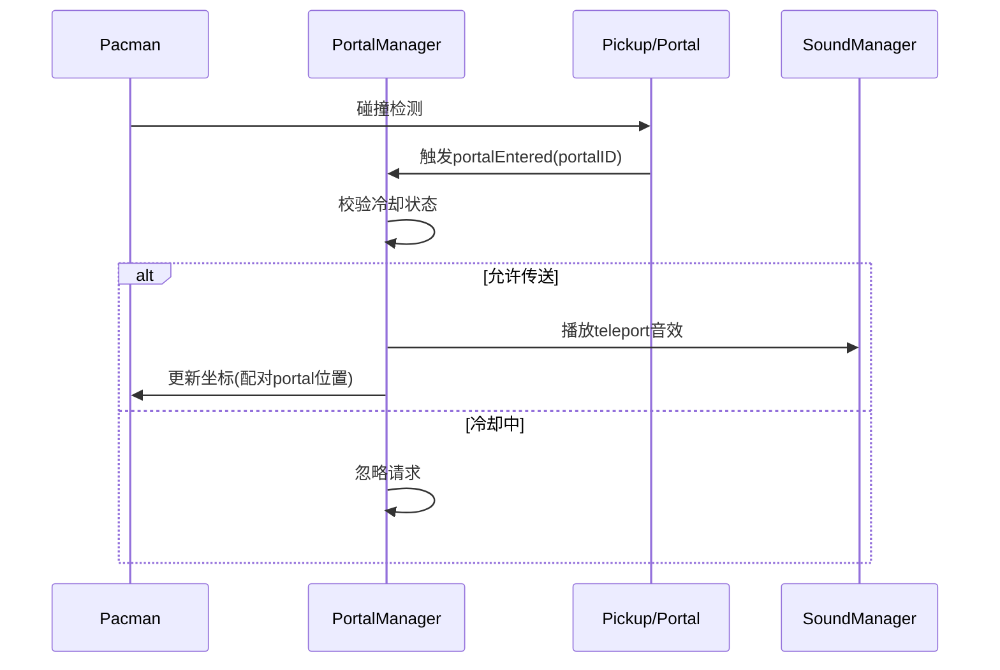

### 优化后的传送门需求分层设计（职责匹配验证版）

---

#### 一、核心容器层 (Container)
1. **GameCoordinator**
   - ✅ 新增传送门初始化（调用PortalManager）
   - ✅ 注册传送相关事件监听器

2. **新增 PortalManager**
   - ✅ 管理传送门配对关系
   - ✅ 处理全局冷却计时（使用Timer类）
   - ✅ 协调跨传送门对象同步
   - ✅ 触发传送音效事件

---

#### 二、实体层 (Entities)
1. **Pacman**
   - ✅ 接收传送位置更新指令

2. **Pickup扩展 Portal子类**
   - ✅ 管理自身动画状态（呼吸效果）
   - ✅ 在碰撞时触发事件（不处理配对逻辑）
   - ✅ 暴露配对传送门ID属性

---

#### 三、逻辑控制层 (Logic)
1. **GameFlow**
   - ✅ 关卡切换时调用PortalManager重置

2. **CharacterUtil**
   - ✅ 新增`calculatePortalExitPosition`方法
   - ✅ 处理坐标越界时的传送映射

---

#### 四、支持系统层 (Support)
1. **SoundManager**
   - ✅ 新增`teleport`音效资源
   - ✅ 响应PortalManager的音效触发事件

---

#### 五、工具与数据层 (Utilities)
1. **GameUtilities**
   - ✅ 扩展迷宫数据格式（增加`P`标记传送门）
   - ✅ 提供`validatePortalPairs`校验方法

---

### 优化后的模块交互流程

### 设计合理性总结
1. **职责固化**：各层仅处理本层核心逻辑，通过事件和管理器协调
2. **事件解耦**：实体类仅触发/响应事件，不与具体逻辑模块直接耦合
3. **状态集中**：PortalManager统一管理业务敏感状态（冷却、配对）
4. **扩展安全**：新增传送门类型只需扩展Portal子类，不影响核心逻辑
5. **数据隔离**：静态配置与动态逻辑分离（GameUtilities vs PortalManager）